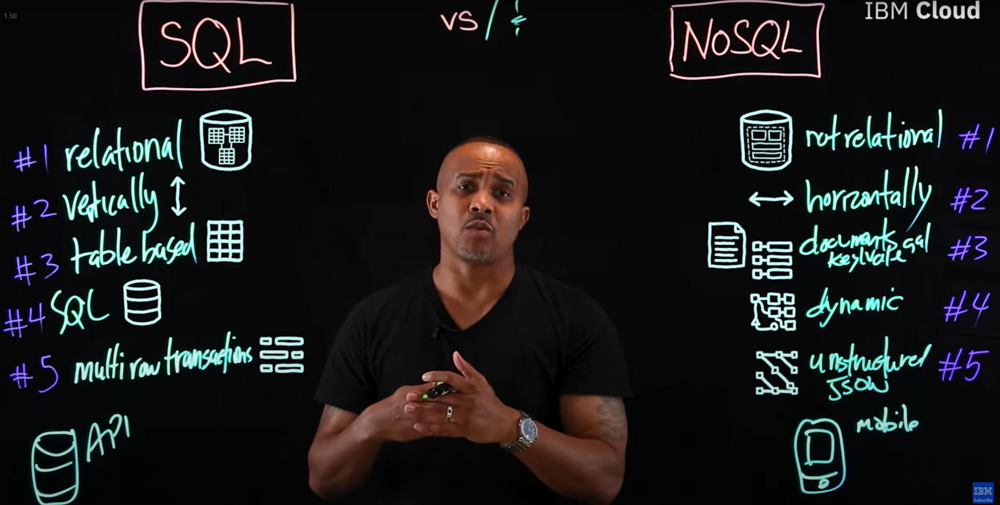

# SQL notes
## SQL vs NoSQl

**[SQL vs. NoSQL: What's the difference?](https://www.youtube.com/watch?v=Q5aTUc7c4jg)**

## sqlite3 and MySQL python codes
- **[sqlite3](https://github.com/youssef-omarrr/Python-Files/blob/master/youssefsql.py)**
- **[MySQL](https://github.com/youssef-omarrr/Python-Files/blob/master/ySQL.py)**
- **[mysql cheat sheet](https://overapi.com/mysql)**

## Notes
- The first category of commands are for setting up the database (`CREATE DATABASE`), setting up an individual table (`CREATE TABLE`), and similar commands for altering or destroying them. The *setup information* for your database is stored in a special file called the **“Schema”**, and this is updated whenever you make changes to the structure of your database.
- Think of the **schema** as saying “here’s our *database* and it’s got a couple *tables*".
- You can tell your database to index a column for **faster** searching later with `CREATE INDEX`. Create indexes, which basically do all the hard work of *sorting your table ahead of time*, for columns that you’ll likely be using to search on later (like username)… it will make your database much faster.
- A close cousin of `SELECT`, for if you only want **unique** values of a column, is `SELECT DISTINCT`. Say you want a list of all the different names of your users *without any duplicates…* try `SELECT DISTINCT users.name FROM users`.

## Mashing tables together
If you want to get all the posts created by a given user, you need to tell SQL which columns it should use to zip the tables together with the `ON` clause. Perform the “zipping” with the `JOIN` command. But wait, if you mash two tables together where the data doesn’t perfectly match up (e.g. there are multiple posts for one user), which rows do you actually keep? There are four different possibilities:

    note: The “left” table is the original table (the one that the `FROM` clause was `ON`), e.g. “users” in examples below.

1. `INNER JOIN`, aka `JOIN` – Your best friend and 95% of what you’ll use. Keeps only the rows from both tables where they match up. If you asked for all the posts for all users (`SELECT * FROM users JOIN posts ON users.id = posts.user_id`), it would **return only the users who have actually written posts** and only posts which have specified their author in the `user_id` column. If an author has written multiple posts, there will be multiple rows returned (but the columns containing the user data will just be repeated).

2. `LEFT OUTER JOIN` – keep **all** the rows from the left table and add on any rows from the right table which match up to the left table’s. Set any empty cells this produces to `NULL`. E.g. return all the users whether they have written posts or not. If they do have posts, list those posts as above. If not, set the columns we asked for from the “posts” table to `NULL`.

3. `RIGHT OUTER JOIN` – the opposite… keep all rows in the right table.
4. `FULL OUTER JOIN` – Keep all rows from all tables, even if there are mismatches between them. Set any mismatched cells to `NULL`.

- [**A Visual Explanation of SQL Joins**](https://blog.codinghorror.com/a-visual-explanation-of-sql-joins/)

## Summary of all SQL commands
Below are concrete SQL code examples for each of the five core SQL command categories—DDL, DML, DQL, DCL, and TCL—as defined by the SQL standard.

## Data Definition Language (DDL)  
DDL commands define or modify the schema of database objects such as tables and indexes citeturn0search5turn0search21.

### CREATE TABLE  
```sql
CREATE TABLE Employee (
    EmpID     INT        PRIMARY KEY,
    FirstName VARCHAR(50),
    LastName  VARCHAR(50),
    HireDate  DATE,
    Salary    DECIMAL(10,2)
);
```  

### ALTER TABLE  
```sql
-- Add a new column
ALTER TABLE Employee
ADD Department VARCHAR(50);

-- Modify existing column datatype
ALTER TABLE Employee
ALTER COLUMN Salary DECIMAL(12,2);
```  

### DROP TABLE  
```sql
DROP TABLE IF EXISTS Old_Employees;
```  

---

## Data Manipulation Language (DML)  
DML commands operate on the data within tables, enabling insertion, updating, and deletion of rows citeturn0search1turn0search11.

### INSERT  
```sql
INSERT INTO Employee (EmpID, FirstName, LastName, HireDate, Salary, Department)
VALUES (101, 'Alice', 'Smith', '2022-05-15', 75000.00, 'Marketing');
```  

### UPDATE  
```sql
UPDATE Employee
SET Salary = Salary * 1.05
WHERE Department = 'Marketing';
```  

### DELETE  
```sql
DELETE FROM Employee
WHERE HireDate < '2010-01-01';
```  

---

## Data Query Language (DQL)  
DQL is focused on retrieving data, with `SELECT` as its primary statement citeturn0search2turn0search12.

```sql
SELECT EmpID,
       CONCAT(FirstName, ' ', LastName) AS FullName,
       Department,
       Salary
FROM Employee
WHERE Salary > 60000
ORDER BY HireDate DESC;
```  

---

## Data Control Language (DCL)  
DCL commands manage permissions and access control, using statements like `GRANT` and `REVOKE` citeturn0search8turn0search13.

```sql
-- Grant SELECT and INSERT privileges on Employee table to user 'hr_user'
GRANT SELECT, INSERT
ON Employee
TO hr_user;

-- Revoke INSERT privilege from user 'hr_user'
REVOKE INSERT
ON Employee
FROM hr_user;
```  

---

## Transaction Control Language (TCL)  
TCL commands define transaction boundaries to ensure data integrity, including `COMMIT`, `ROLLBACK`, and `SAVEPOINT` citeturn0search4turn0search14.

```sql
BEGIN TRANSACTION;

-- Perform multiple operations
UPDATE Account SET Balance = Balance - 500 WHERE AccountID = 123;
SAVEPOINT AfterWithdrawal;

UPDATE Account SET Balance = Balance + 500 WHERE AccountID = 456;

-- If something goes wrong, roll back to savepoint
-- ROLLBACK TO AfterWithdrawal;

COMMIT;
```  

## Exercies
- [SQL Teaching](https://www.sqlteaching.com/#!where_equals)
- [SQL Zoo](https://sqlzoo.net/w/index.php?title=SQL_Tutorial&redirect=no)