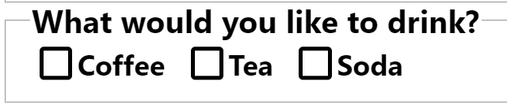

### **1. Basic Document Structure**
```html
<!DOCTYPE html>
<html lang="en">
<head>
    <link rel="stylesheet" href="Form Basics.css">
    <meta charset="UTF-8">
    <meta name="viewport" content="width=device-width, initial-scale=1.0">
</head>
<body>
    <!-- Form and other elements here -->
    <script src="Form Basics.js" defer></script>
</body>
</html>
```
- **DOCTYPE**: Declares the document as HTML5.
- **HTML Root**: `<html lang="en">` specifies the language (English).
- **Head Section**:
  - Links to an external CSS file (`Form Basics.css`).
  - `meta charset="UTF-8"` ensures proper character encoding.
  - `viewport` meta tag enables responsive design.
- **Script Tag**: Loads JavaScript file `Form Basics.js` with `defer` to delay execution until HTML is parsed.

---

### **2. Form Attributes**
```html
<form action="https://httpbin.org/post" method="post">
```
- **`action`**: Specifies where the form data is sent (to `https://httpbin.org/post`, a testing endpoint).
- **`method`**: 
  - `POST` (used here) sends data to the server for processing (e.g., creating/updating records).
  - `GET` appends data to the URL (used for searches, bookmarks).

---

### **3. Input Fields & Labels**
#### **Text Inputs**
```html
<label for="first_name">First Name: </label>
<input type="text" id="first_name" placeholder="bepbop_" name="first_name">
```
- **Label-Input Association**: `for="first_name"` links the label to the input with `id="first_name"`.
- **Attributes**:
  - `type="text"`: Standard text input.
  - `placeholder`: Displays hint text when empty.
  - `name`: Key for form data submission (e.g., `first_name=bepbop_`).

#### **Other Input Types**
```html
<input type="email" id="user_email" name="user_email"> <!-- Validates email format -->
<input type="password" id="user_password" name="password"> <!-- Masks input -->
<input type="number" id="amount" name="amount"> <!-- Numeric input -->
<input type="date" id="dob" name="dob"> <!-- Date picker -->
```

---

### **4. Form Controls**
#### **Radio Buttons**
```html
<input type="radio" id="child" name="ticket_type" value="child">
<label for="child">Child</label>
```
- **Grouping**: Radio buttons with the same `name` (e.g., `ticket_type`) are mutually exclusive.
- **`value`**: Data sent to the server when selected.
- **Default Selection**: Use `checked` (e.g., `<input type="radio" ... checked>`).

#### **Checkboxes**
```html
<input type="checkbox" id="sausage" name="topping" value="sausage">
<label for="sausage">Sausage</label>
```
- **Multiple Selections**: Checkboxes with the same `name` allow multiple values.

#### **Dropdowns**
```html
<select name="cars" id="cars">
    <option value="car1">car1</option>
    <option value="car3" selected>car3</option>
</select>
```
- **`selected`**: Sets the default option (e.g., `car3`).
- **`optgroup`**: Groups options under a label:
  ```html
  <optgroup label="Clothing">
      <option value="t_shirt">T-Shirts</option>
  </optgroup>
  ```

#### **Textarea**
```html
<textarea rows="5" cols="20" name="textt" id="textt">wopwopwop</textarea>
```
- **Multi-line text input**: Default text between opening/closing tags.

---

### **5. Buttons**
```html
<button type="submit">Submit</button> <!-- Submits form -->
<button type="reset">Reset</button>   <!-- Clears form data -->
<button type="button">Click to Toggle</button> <!-- Generic button (requires JS) -->
```
- **`type`**:
  - `submit`: Triggers form submission.
  - `reset`: Resets form fields to defaults.
  - `button`: No default action (requires JavaScript).

---

### **6. Grouping with Fieldset**
```html
<fieldset>
    <legend>Contact Details</legend>
    <!-- Inputs here -->
</fieldset>
```
- **`fieldset`**: Groups related form elements.
- **`legend`**: Provides a caption for the group.

---

### **7. Key Notes**
1. **`name` Attribute**:
   - Required for form data submission (omitted inputs are ignored).
   - Acts as the key in key-value pairs (e.g., `first_name=bepbop_`).

2. **Accessibility**:
   - Always use `<label>` with `for` to link labels to inputs.
   - Use semantic elements like `fieldset` and `legend` for screen readers.

3. **Default Values**:
   - Use `placeholder` for hints, `value` for pre-filled data.
   - `checked` (radio/checkbox) and `selected` (dropdown) set defaults.

---

### **8. Code Flow Summary**
1. The form sends data to `https://httpbin.org/post` via `POST`.
2. Inputs collect user data (text, email, password, etc.).
3. Radio buttons, checkboxes, and dropdowns offer constrained choices.
4. Fieldsets organize the form into sections.
5. Buttons trigger actions (submit, reset, or custom JS).

---

### **9. Common Pitfalls**
- **Missing `name`**: Inputs without `name` won’t send data.
- **Incorrect Labels**: Ensure `for` and `id` match.
- **Overusing `placeholder`**: Not a substitute for labels.
  
---
### **10. Custom checkboxes**
- **[Go to this link to create checkboxes with this style](https://moderncss.dev/pure-css-custom-checkbox-style/)**\



- [**Improving UX froms**](https://www.silocreativo.com/en/css-rescue-improving-ux-forms/)