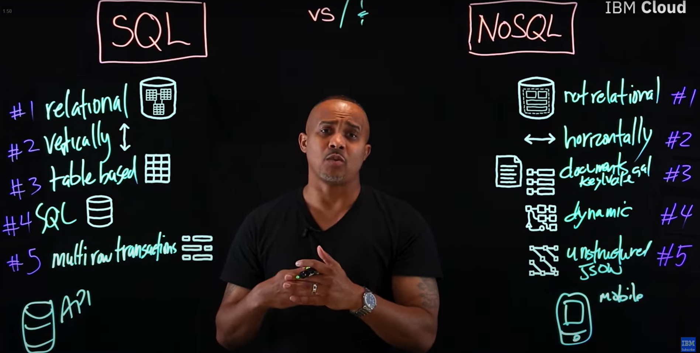
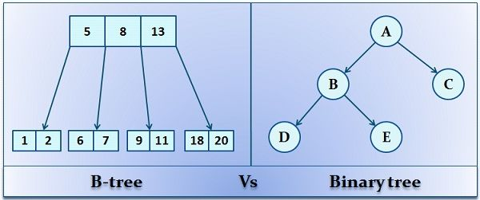
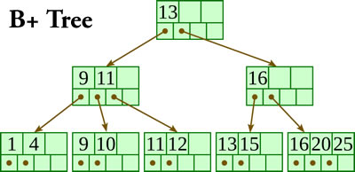

# 1. **Document-Based vs Relational Databases:**
**Key Concepts & Comparisons**  

#### **Relational Databases (SQL)**  
1. **Structure**:  
   - **Tables**: Data organized into rows (records) and columns (fields).  
   - **Schema**: Fixed schema with predefined data types and relationships (e.g., `users` table with `id`, `name`, `email`).  
   - **Relationships**: Linked via foreign keys (e.g., `orders.user_id` references `users.id`).  

2. **Features**:  
   - **ACID Compliance**: Ensures transactional integrity (Atomicity, Consistency, Isolation, Durability).  
   - **Complex Queries**: Supports JOINs, subqueries, and aggregations.  
   - **Normalization**: Reduces redundancy by splitting data into related tables.  

3. **Use Cases**:  
   - Applications requiring complex transactions (e.g., banking systems).  
   - Structured data with strict relationships (e.g., inventory management).  

**Examples**: MySQL, PostgreSQL, Oracle.  

---

#### **Document-Based Databases (NoSQL)**  
1. **Structure**:  
   - **Documents**: Data stored as JSON/BSON objects (e.g., `{ id: "123", name: "Alice", orders: [...] }`).  
   - **Schema-less**: Flexible schema; fields can vary between documents.  
   - **Nested Data**: Supports hierarchical data (e.g., embedding orders within a user document).  

2. **Features**:  
   - **Horizontal Scalability**: Easier to distribute across servers (sharding).  
   - **Denormalization**: Stores related data together for faster reads.  
   - **BASE Model**: Prioritizes availability over consistency (Basically Available, Soft state, Eventually consistent).  

3. **Use Cases**:  
   - Unstructured or semi-structured data (e.g., CMS content, user profiles).  
   - Rapidly evolving applications (e.g., real-time analytics, IoT).  

**Examples**: MongoDB, CouchDB, Firebase Firestore.  

---

#### **Key Differences**  
| **Aspect**            | **Relational Databases**                     | **Document Databases**                      |  
|------------------------|----------------------------------------------|---------------------------------------------|  
| **Schema**             | Fixed schema, strict data types.             | Dynamic schema, flexible structure.         |  
| **Scalability**        | Vertical scaling (hardware upgrades).        | Horizontal scaling (add more servers).      |  
| **Query Language**     | SQL (Structured Query Language).             | Proprietary query languages (e.g., MongoDB Query Language). |  
| **Data Relationships** | Supports complex joins and referential integrity. | Limited joins; encourages denormalization.  |  
| **Transactions**       | ACID-compliant (strong consistency).         | Often eventual consistency (BASE model).    |  

---

#### **When to Use Which?**  
1. **Relational Databases**:  
   - Complex transactions (e.g., financial systems).  
   - Applications requiring strict data integrity (e.g., healthcare records).  
   - Reporting/analytics with multi-table joins.  

2. **Document Databases**:  
   - Agile development with evolving data models.  
   - Hierarchical or nested data (e.g., social media posts with comments).  
   - High write/read throughput (e.g., logging, real-time feeds).  

---

#### **Hybrid Approaches**  
- **NewSQL**: Combines SQL scalability with NoSQL flexibility (e.g., CockroachDB).  
- **Relational + JSON**: Modern SQL databases (e.g., PostgreSQL) support JSON columns for semi-structured data.  

---

### Example Exam Questions & Answers  
1. **Q**: Explain the trade-offs between normalization (SQL) and denormalization (NoSQL).  
   **A**:  
   - **Normalization** reduces redundancy and ensures consistency but requires complex JOINs.  
   - **Denormalization** improves read speed by duplicating data but complicates updates.  

2. **Q**: Why might a startup choose a document database over a relational one?  
   **A**:  
   - Document databases allow rapid iteration without schema migrations, handle unstructured data, and scale horizontally as user growth demands.  

3. **Q**: How do relational databases enforce data integrity, and what is a limitation of document databases in this context?  
   **A**:  
   - Relational databases use foreign keys and ACID transactions. Document databases lack built-in referential integrity, requiring application-level checks.  

4. **Q**: Describe a scenario where a document database is unsuitable.  
   **A**:  
   - Applications needing complex multi-document transactions (e.g., banking transfers), where ACID compliance is critical.  

5. **Q**: What is the CAP theorem, and how does it apply to these databases?  
   **A**:  
   - **CAP Theorem**: A distributed system can only guarantee two of Consistency, Availability, Partition Tolerance.  
   - Relational databases prioritize Consistency and Availability (CA). Document databases often prioritize Availability and Partition Tolerance (AP).  

---

### Key Takeaways for Exam Preparation  
- **Relational Databases**: Focus on ACID, normalization, and complex queries.  
- **Document Databases**: Emphasize flexibility, scalability, and hierarchical data.  
- **Schema Design**: Understand trade-offs between rigidity (SQL) and agility (NoSQL).  
- **Hybrid Trends**: Note modern SQL databases adopting NoSQL features (e.g., JSON support).  

For deeper insights, explore [MongoDB vs PostgreSQL](https://www.mongodb.com/compare/mongodb-postgresql) and [ACID vs BASE](https://www.dataversity.net/acid-vs-base-the-shifting-ph-of-database-transaction-processing/).
        
# 2. **B+-Trees vs B-Trees:**
**Key Concepts & Comparisons**\

#### **B-Trees**  
1. **Structure**:  
   - **Balanced Tree**: All leaf nodes are at the same depth.  
   - **Node Composition**:  
     - Internal nodes store **keys** and **pointers** to child nodes.  
     - **Data** (key-value pairs) can reside in **both internal and leaf nodes**.  
   - **Order**: A B-Tree of order \( m \) allows \( m-1 \) keys and \( m \) child pointers per node.  

2. **Operations**:  
   - **Search**: Navigate from root to leaf, comparing keys at each node.  
   - **Insert/Delete**: Split or merge nodes to maintain balance.  
   - **Range Queries**: Less efficient due to scattered data in internal nodes.  

3. **Use Cases**:  
   - File systems (e.g., NTFS, ReiserFS).  
   - Databases requiring frequent random access.  

---

#### **B+-Trees**  
1. **Structure**:  
   - **Linked Leaf Nodes**: All leaf nodes form a **singly linked list** for sequential access.  
   - **Node Composition**:  
     - **Internal nodes**: Store **keys only** (no data), acting as separators.  
     - **Leaf nodes**: Store **all data entries** (key-value pairs).  
   - **Order**: Similar to B-Trees, but internal nodes maximize keys to reduce tree height.  

2. **Operations**:  
   - **Search**: Similar to B-Trees, but always ends at a leaf node.  
   - **Range Queries**: Extremely efficient—traverse linked leaves after initial lookup.  
   - **Insert/Delete**: Data changes affect only leaves; internal nodes update keys as needed.  

3. **Use Cases**:  
   - Database indexing (e.g., MySQL InnoDB, PostgreSQL).  
   - Systems prioritizing range scans (e.g., time-series data).  

---

#### **Key Differences**  
| **Aspect**          | **B-Tree**                                  | **B+Tree**                                  |  
|----------------------|---------------------------------------------|---------------------------------------------|  
| **Data Storage**     | Data in internal and leaf nodes.            | Data **only in leaf nodes**.                |  
| **Range Queries**    | Less efficient (data scattered).            | Optimized via linked leaf nodes.            |  
| **Tree Height**      | Slightly taller (internal nodes store data).| Shorter (internal nodes store only keys).   |  
| **Disk I/O**         | Higher for large datasets.                  | Lower due to sequential leaf access.        |  
| **Redundancy**       | Keys may repeat in internal nodes.          | Keys in leaves are **actual data keys**.    |  

---

#### **Why B+-Trees Dominate Databases?**  
1. **Range Query Efficiency**:  
   - Sequential scans via linked leaves avoid backtracking up the tree.  
2. **Higher Fan-Out**:  
   - Internal nodes store more keys, reducing tree height and disk seeks.  
3. **Predictable Performance**:  
   - All searches require the same number of steps (height of the tree).  

---

### Example Exam Questions & Answers  
1. **Q**: Why are B+-Trees preferred over B-Trees for database indexing?  
   **A**:  
   - B+-Trees store data **only in leaf nodes** and link leaves for sequential access, optimizing range queries. Internal nodes maximize keys, reducing tree height and disk I/O.  

2. **Q**: How does a B+-Tree handle a range query (e.g., "find all records between 10 and 20")?  
   **A**:  
   - After locating the starting key (10) in a leaf, the linked list of leaves is traversed sequentially to collect all keys up to 20, minimizing disk reads.  

3. **Q**: What is a disadvantage of B-Trees compared to B+-Trees?  
   **A**:  
   - B-Trees store data in internal nodes, leading to **higher tree height** and **inefficient range queries**.  

4. **Q**: Explain how B+-Trees reduce disk I/O during searches.  
   **A**:  
   - By storing only keys in internal nodes, B+-Trees fit more keys per node (higher fan-out), reducing tree height and the number of disk accesses.  

5. **Q**: Can a B-Tree outperform a B+-Tree in any scenario?  
   **A**:  
   - Yes, for **exact-match queries** where data is in internal nodes, B-Trees may require fewer steps. However, this advantage is marginal compared to B+-Tree benefits for databases.  

---

### Key Takeaways for Exam Preparation  
- **B+-Tree Advantages**: Focus on linked leaves for range queries, higher fan-out, and data isolation in leaves.  
- **B-Tree Use Cases**: Highlight file systems and random-access-heavy workloads.  
- **Tree Balance**: Both maintain balance via splits/merges, but B+-Trees optimize for disk-based storage.  

For deeper insights, explore [Database Indexing Strategies](https://www.geeksforgeeks.org/indexing-in-databases-set-1/) and [B+Tree Visualization](https://www.cs.usfca.edu/~galles/visualization/BPlusTree.html).

Videos for B-trees (very recommended): 
- [B-trees in 4 minutes — Intro](https://www.youtube.com/watch?v=FgWbADOG44s&t=43s)
- [B-trees in 6 minutes — Properties](https://www.youtube.com/watch?v=fAfuZiFDpRo)
- [B-trees in 6 minutes — Insertions](https://www.youtube.com/watch?v=tT2DT9Z4H-0)
  
        
# 3. **Soft Deletion in Databases:**
**Key Concepts & Strategies**  

#### **Soft Deletion**  
1. **Definition**:  
   - A technique where records are marked as "deleted" (e.g., via a flag or timestamp) **without physically removing them** from the database.  
   - Example: Setting `is_deleted = TRUE` or `deleted_at = CURRENT_TIMESTAMP`.  

2. **Key Components**:  
   - **Flag Column**: Boolean (e.g., `is_deleted`) or timestamp (e.g., `deleted_at`) to track deletion status.  
   - **Data Retention**: Retains historical data for auditing, recovery, or compliance.  
   - **Query Filtering**: Exclude soft-deleted records in most queries (e.g., `WHERE is_deleted = FALSE`).  

---

#### **Soft Deletion vs Hard Deletion**  
| **Aspect**          | **Soft Deletion**                            | **Hard Deletion**                     |  
|----------------------|----------------------------------------------|---------------------------------------|  
| **Data Removal**     | Logical (marked as deleted).                | Physical (permanently erased).        |  
| **Recovery**         | Easy (toggle flag).                         | Requires backups/logs.                |  
| **Storage Overhead** | Increases over time.                        | No overhead.                          |  
| **Use Cases**        | Auditing, compliance, referential integrity.| Sensitive data (e.g., GDPR erasure).  |  

---

#### **Implementation Strategies**  
1. **Flag-Based**:  
   - Add a column like `is_deleted BOOLEAN DEFAULT FALSE`.  
   - **Pros**: Simple, easy to query.  
   - **Cons**: Requires updating all queries to filter soft-deleted records.  

2. **Timestamp-Based**:  
   - Use `deleted_at TIMESTAMP NULL` (non-null value indicates deletion).  
   - **Pros**: Tracks deletion time for auditing.  

3. **Status Enum**:  
   - Column `status ENUM('active', 'deleted')`.  
   - **Pros**: Extensible for multi-state workflows (e.g., archived, suspended).  

4. **Partitioning/Archiving**:  
   - Move soft-deleted records to a separate table (e.g., `users_deleted`).  
   - **Pros**: Keeps main tables lean; simplifies queries.  

---

#### **Challenges & Solutions**  
1. **Query Complexity**:  
   - **Problem**: Forgetting to filter soft-deleted records in queries.  
   - **Solution**: Use database views or ORM scopes (e.g., `User.active` in Rails).  

2. **Unique Constraints**:  
   - **Problem**: Unique fields (e.g., email) conflict if a soft-deleted record exists.  
   - **Solution**: Include the soft-deletion flag in the unique index (e.g., `UNIQUE(email, is_deleted)`).  

3. **Performance**:  
   - **Problem**: Large tables with many soft-deleted records slow down queries.  
   - **Solution**: Index the deletion flag and archive old records periodically.  

4. **GDPR Compliance**:  
   - **Problem**: "Right to be forgotten" requires actual data deletion.  
   - **Solution**: Hard delete after retention period or anonymize data.  

---

#### **Use Cases**  
1. **Audit Trails**: Track changes and deletions for compliance (e.g., financial systems).  
2. **E-commerce**: Retain order history even after user "deletion."  
3. **User Management**: Allow account reactivation without data loss.  

---

### Example Exam Questions & Answers  
1. **Q**: Compare soft deletion and hard deletion in terms of data recovery and compliance.  
   **A**:  
   - **Soft Deletion**: Enables easy recovery via flag toggling but may conflict with GDPR’s "right to erasure."  
   - **Hard Deletion**: Complies with GDPR but requires backups for recovery.  

2. **Q**: How would you enforce uniqueness for a user’s email in a soft-deletion system?  
   **A**:  
   - Create a composite unique index on `email` and `is_deleted` (or `deleted_at`), ensuring only one active user per email.  

3. **Q**: What is a drawback of soft deletion, and how can it be mitigated?  
   **A**:  
   - **Drawback**: Accumulation of stale data bloats tables.  
   - **Mitigation**: Archive old records or periodically hard delete obsolete data.  

4. **Q**: Why might soft deletion complicate foreign key constraints?  
   **A**:  
   - If a soft-deleted record is referenced by another table (e.g., `orders.user_id`), the foreign key must either allow NULL or reference only active records via filtered constraints.  

5. **Q**: How can ORM tools simplify soft deletion implementation?  
   **A**:  
   - ORMs like Django or Rails provide scopes (e.g., `default_scope { where(deleted_at: nil) }`) to auto-filter soft-deleted records, reducing query errors.  

---

### Key Takeaways for Exam Preparation  
- **Soft Deletion**: Prioritize data retention and recovery but manage storage and query complexity.  
- **Implementation**: Use flags/timestamps, enforce unique constraints, and filter queries systematically.  
- **Compliance**: Balance soft deletion with legal requirements (e.g., GDPR) via anonymization or scheduled hard deletion.  

For deeper insights, explore [Soft Deletion Best Practices](https://www.mikealdo.com/2016/03/13/Soft-deletion-common-patterns-and-how-to-do-it-right.html) and [GDPR Compliance Strategies](https://gdpr-info.eu/).
    
  